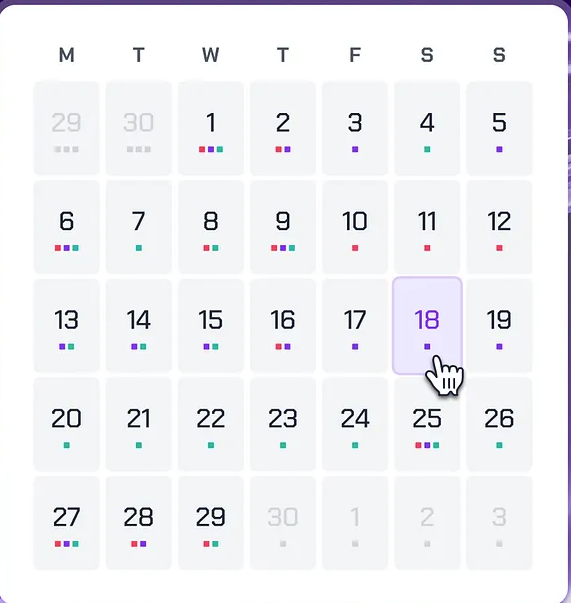
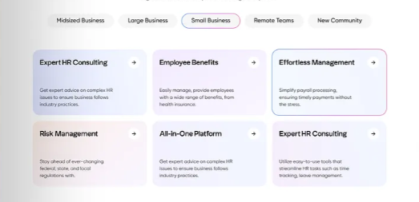
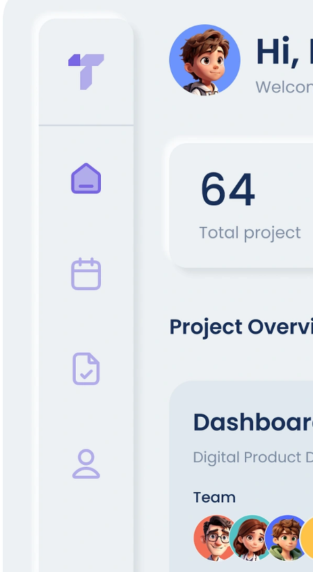
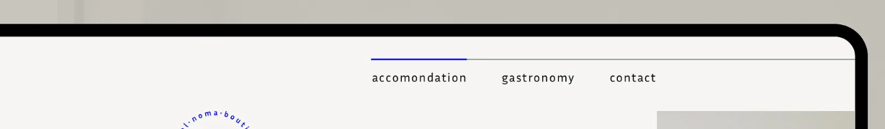
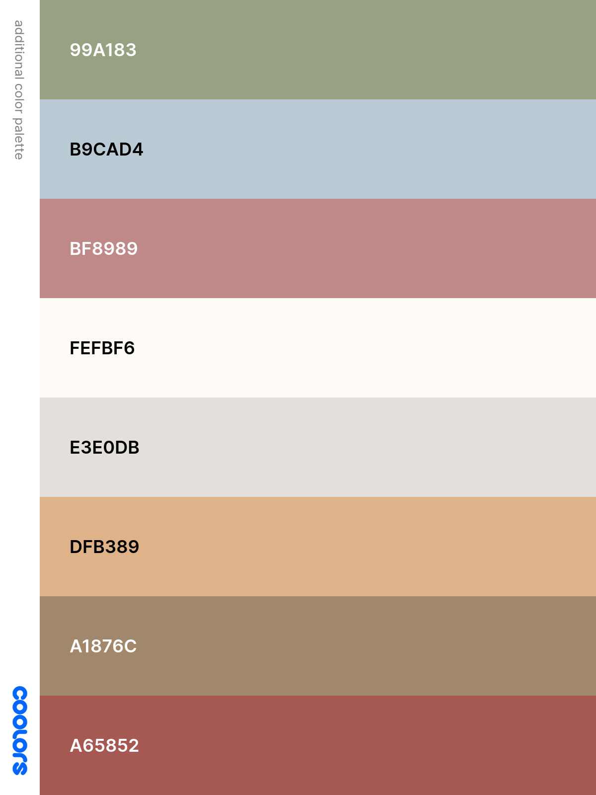
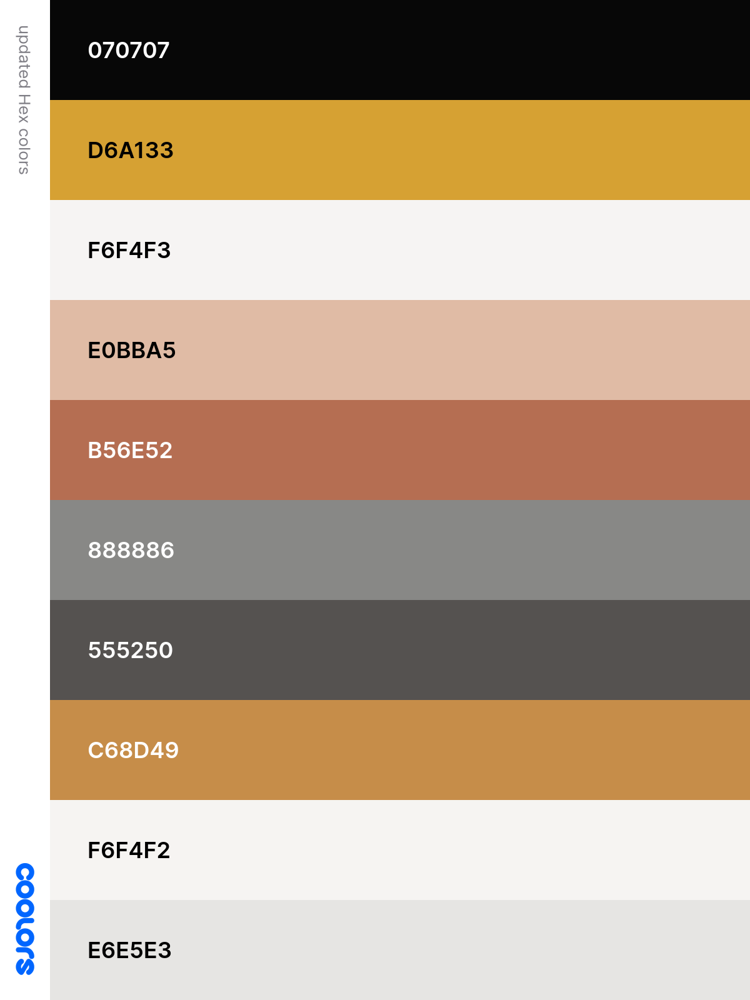
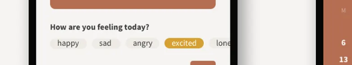

# periodic.ally   

## Installation Instructions 

1.  **Clone the repository:**

    ```
    git clone https://github.com/candiceojleung/candice-leung-capstone
    ```

2.  **Install dependencies:**

    ```
    npm install
    ```

3.  **Start the development server:**

    ```
    npm run dev
    ```

## Overview

periodic.ally is a web application designed to empower users to manage their reproductive health. This web application will serve as an ally to those navigating complex interplay between reproductive, physical and mental well-being.  By offering comprenhensive tracking, users can uncover potential correlation between different aspects of their health and gain insight to their body's unique needs and patterns. 

### Problem Space

Misdiagnosis is a significant issue in female health, particularly concerning reproductive health conditions. Medical education has historically been centered on male physiology, leading to gaps in understanding female-specific conditions. This results in symptoms being overlooked or misattributed. Furthermore many individuals have their symptoms frequently dismissed as stress, hormonal changes, or psychological issue.

1 in 4 women (24%) surveyed experienced a misdiagnosis of a gynaecological condition, including endometriosis, PCOS, pregnancy, ovarian cysts, and period pain. Endometriosis is the most frequently misdiagnosed gynaecological condition, affecting nearly 1 in 10 women. 75.2% of endometriosis patients reported being misdiagnosed with another physical health (95.1%) and/or mental health problem (49.5%). PCOS (Polycystic Ovary Syndrome) is also highly correlated with disorders such as Type 2 diabetes, increased risk of heart disease, sleep apnea, and mood disorders. 

### User Profile

The web application can be used by folks who wish to record their reproductive health journey and track other physical and mental health conditions. The app will make note on days where symptoms are most severe. This ensures users can accurately display information to medical professionals and observe trends throughout their usage of the application. 


### Features

**User Capabilities**
- Period Tracking: Users can state whether or not they have their period that day and select the type of flow.

- Physical Symptom Tracking: Users can select physical symptoms such as bloating, cramps, nausea, headaches, and fatigue.

- Mental Health Tracking: Users can track mental health conditions including depressed, irritable, anxious, and stressed.

- Log Management: Users can edit existing log entries to update symptoms or flow type using prepopulated options, and delete existing log entries.

**Visual Representation**
- The calendar view will highlight each day based on how many symptoms have been logged. This will help users identify trends.

**Additional Resources**
- Users will also be able to navigate to a resources page and find more information on different health conditions and tools to help manage symptoms.- 

## Implementation

### Tech Stack

- React (react-router-dom, axios)
- Javascript
- MySQL
- Express
- Node.js
- Knex

### APIs
No external APIs used.

### Sitemap

**Home Page**
- Overview of the app's purpose and features
- Calendar 
- Footer with contact information and quick links

On the Homepage there will be the:  
**Tracker**
- Menstrual cycle tracking (e.g., period start/end, flow type)
- Physical symptom logging (e.g., cramps, fatigue)
- Mental health logging (e.g., mood tracking)
- Color-coded calendar view to visualize symptoms tracked

A second page:
- About Us page touching about mission of App

A third page: 
**Resources Page**
- Articles and guides on reproductive health conditions (e.g., endometriosis, PCOS)
- Tips for managing symptoms effectively

A fourth page:
- FAQs about app usage


### Mockups

Inspiration for website layout and toggles: 








### Data

The app's data structure will include the following key entities:

- **Health Logs**: Daily entries capturing period status (yes/no), flow type (light medium/heavy), physical symptoms, and mental states.
- **Resources Data**: Articles, tips, and links categorized by health topics.
- **Calendar Colors**: Color coded tracking linked to daily logs.

Relationships Between Data Points:
- Each user has health log linked by date.
- Calendar colors are dynamically generated based on log data.

### Endpoints

The server will implement the following endpoints:


***Health Logs:***
**GET** /logs /:id : Retrieve logs for a user on specific day (parameters: log ID).
Request GET /logs?userId=1: 
```
  {
    "logId": 101,
    "userId": 1,
    "date": "2025-03-10",
    "symptoms": {
      "physical": ["bloating", "cramps"],
      "mental": ["obsessive thoughts"]
    },
    "flowType": "Heavy",
  }
```
**POST** /logs : Add a new log entry (parameters: date, symptoms, mood).
Request:
```
    {
  "userId": 1,
  "date": "2025-03-12",
  "symptoms": {
    "physical": ["headaches", "nausea"],
    "mental": ["irritable"]
  },
  "flowType": null,

}
```
Response:
```
    {
  "message": "Log added successfully!",
  "logId": 103
}
```
**PUT** /logs/:id: Update an existing log entry (parameters: log ID, updated data).
Request: PUT/logs/103
```
{
  "logId": 103,
  "updatedData": {
    "symptoms": {
      "physical": ["headaches"],
      "mental": ["anxious"]
    }
  }
}
```
Response:
```
    {
  "message": "Log updated successfully!"
}
```
**DELETE**/logs/:id: Delete an existing long entry (parameters: log ID)
Response: DELETE /logs/103
```
{
  "message": "Log deleted successfully!"
}
```

## Roadmap

***WEEK 1***
***Initialize project:*** 
- Create client
  - react project with routes and boilerplate pages
- Create server
  - express project with routing, with placeholder 200 responses

***Work on backend:***
- Create table
- Create migrations
- Create content to populate database with 
- Run seed 
- Deploy client and server projects so all commits will be reflected in production

**Work on frontend:**
**Feature: HomePage**
  - create homepage 
  - link to other pages 
  
***WEEKEND 1***
**Feature: Calendar** 
  - Generate functionality to highlight severity in calendar view
  - Allow users to click into specific days and GET log for the day

***WEEK 2***
**Feature: Symptom Tracker**
  - Create preselected options
  - Create POST request to log entries
  - Create PUT request to update entries
  - Create DELETE request to delete entries 
  - States for add & update log entries

**Feature: Resource Page**
  - Create sample articles, and resources 

***WEEKEND 2***
- Bug fixes

- DEMO DAY

---
## Future Implementations
- Implementing AI to answer questions and find resources for users/ predictive cycle potentially
- Implement a sleep, water, weight tracker as well 
- Create a community page for users to share their experiences 
- implement JWT login capabilities 
- implement user registration (CRUD) on front-end


